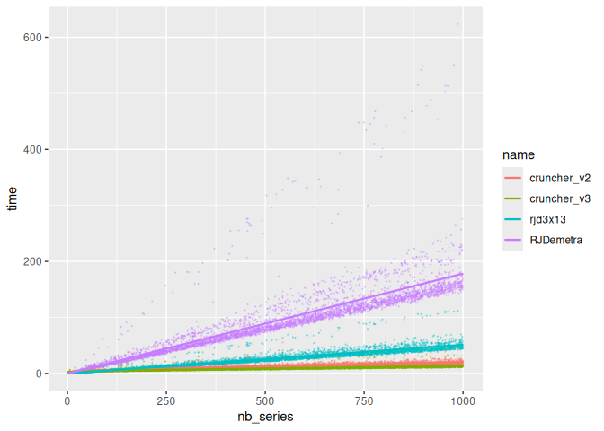

<!-- README.md is generated from README.Rmd. Please edit that file -->

# Comparaison-vitesse-rjdverse

<!-- badges: start -->

<!-- badges: end -->

Ce dépôt contient des programmes de comparaison de vitesse entre les
estimations de CVS-CJO faites par JDemetra+. On compare ici :

- le [cruncher en v2](https://github.com/jdemetra/jwsacruncher)
- le [cruncher en v3](https://github.com/jdemetra/jdplus-main)
- le package [{RJDemetra}](https://github.com/rjdverse/rjdemetra)
  (version 2)
- le package [{rjd3x13}](https://github.com/rjdverse/rjd3x13) (version
  3)

## Méthodologie

On génère des séries aléatoirement avec le package
[{tssim}](https://cran.r-project.org/web/packages/tssim/index.html) et
on compare le temps de calcul de l’estimation du modèle CVS-CJO avec les
différentes méthodes de JDemetra+.

On cherche ici à comparer l’impact du nobre de série sur l’estimation.

## Résultats

Sur toutes les longueurs (de 1 à 1000) :

<!-- -->

Sur moins de 100 séries :

<!-- -->
